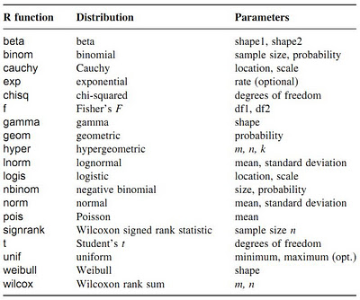

# R语言基础入门之三：常用统计函数运算

在R语言中经常会用到函数，例如上节中讲到的求样本统计量就需要均值函数(mean)和标准差函数(sd)。对于二元数值数据还用到协方差(cov)，对于二元分类数据则可以用交叉联列表函数(table)。下文讲述在初级统计学中最常用到的三类函数。

##一、数据汇总函数

我们还是以R中自带的iris数据为例，输入head(iris)你可以获得数据的前6个样本及对应的5个变量。取出最后两列数据作为讲解的对象：Species表示花的种类，Petal.Width表示花瓣宽度

```r
data=iris[,c(4,5)]
```

下一步我们想计算不同种类花瓣的平均宽度，可以使用tapply函数，在计算前先用attach命令将data这个数据框解包以方便直接操作其变量，而不需再用$符号。

```r
attach(data)
tapply(X=Petal.Width,INDEX=Species,FUN=mean)
```

结果如下

    setosa versicolor  virginica
    0.246      1.326      2.026 

和tapply类似的还有sapply函数，在进一步讲解前初学者还需搞清楚两种数据表现方式，即stack（堆叠数据）和unstack（非堆叠数据），上面的data就是一个堆叠数据，每一行表示一个样本。而非堆叠数据可以根据unstack函数转换而来

```r
data.unstack=unstack(data)
head(data.unstack)
```

你应该明白这二者之间的区别了，如果要对非堆叠数据计算不同种类花瓣的平均宽度，可以利用如下函数。

```r
sapply(data.unstack,FUN=mean)
```

结果是一样的，也就是说tapply对应于stack数据，而sapply对应于unstack数据

## 二、概率计算函数

如果给定一种概率分布，通常会有四类计算问题：

- 计算其概率密度density （d）
- 计算其概率分布probability（p）
- 计算其百分位数quantile （q）
- 随机数模拟random （r）

记住上面四类计算对应的英文首字母，再对照下表就很容易计算各种概率问题了。



举例来讲，我们求标准正态分布曲线下小于1的面积p(x<1)，正态分布是norm，而分布函数是p，那么使用pnorm(1)就得出了结果0.84；若计算扔10次硬币实验中有3次正面向上的概率，类似的dbinom(x=3,size=10,prob=0.5)得出0.11

## 三、抽样函数

我们想从1到10中随机抽取5个数字，那么这样来做：首先产生一个序列，然后用sample函数进行无放回抽取。

```r
x=1:10
sample(x,size=5)
```

有放回抽取则是

```r
sample(x,size=5,replace=T)
```

sample函数在建模中经常用来对样本数据进行随机的划分，一部分作为训练数据，另一部分作为检验数据。 