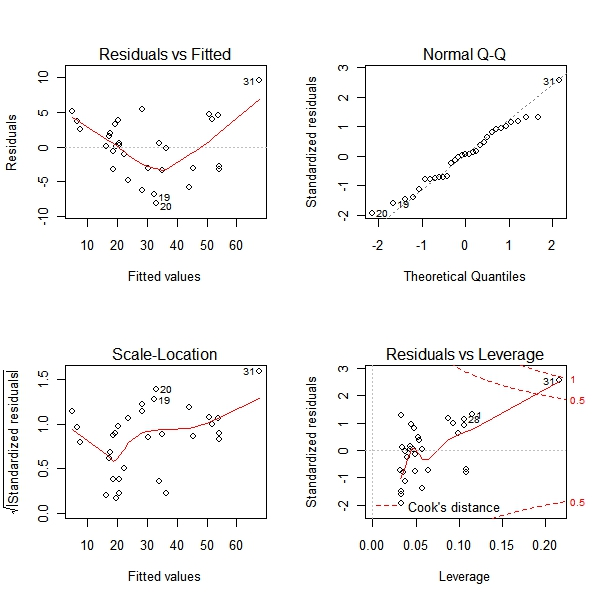

# R语言基础入门之五：简单线性回归

线性回归可能是数据分析中最为常用的工具了，如果你认为手上的数据存在着线性定量关系，不妨先画个散点图观察一下，然后用线性回归加以分析。下面简单介绍一下如何在R中进行线性回归。

## 1 回归建模

我们利用R语言中内置的trees数据，其中包含了Volume（体积）、Girth（树围）、Height（树高）这三个变量，我们希望以体积为因变量，树围为自变量进行线性回归。

```r
plot(Volume~Girth,data=trees,pch=16,col='red')
model=lm(Volume~Girth,data=trees)
abline(model,lty=2)
summary(model)
```

首先绘制了两变量的散点图，然后用lm函数建立线性回归模型，并将回归直线加在原图上，最后用summary将模型结果进行了展示，从变量P值和F统计量可得回归模型是显著的。但截距项不应该为负数，所以也可以用下面方法将截距强制为0。

```r
model2=lm(Volume~Girth-1,data=trees)
```

## 2 模型诊断

在模型建立后会利用各种方式来检验模型的正确性，对残差进行分析是常见的方法，下面我们来生成四种用于模型诊断的图形。

```r
par(mfrow=c(2,2))
plot(model)
par(mfrow=c(1,1)) 
```



这里左上图是残差对拟合值作图，整体呈现出一种先下降后下升的模式，显示残差中可能还存在未提炼出来的影响因素。右上图残差QQ图，用以观察残差是否符合正态分布。左下图是标准化残差对拟合值，用于判断模型残差是否等方差。右下图是标准化残差对杠杆值，虚线表示的cooks距离等高线。我们发现31号样本有较大的影响。

## 3 变量变换

因为31号样本有着高影响力，为了降低其影响，一种方法就是将变量进行开方变换来改善回归结果，从残差标准误到残差图，各项观察都说明变换是有效的。

```r
plot(sqrt(Volume)~Girth,data=trees,pch=16,col='red')
model2=lm(sqrt(Volume)~Girth,data=trees)
abline(model2,lty=2)
summary(model2)
```


## 4 模型预测

下面根据上述模型计算预测值以及置信区间，predict函数可以获得模型的预测值，加入参数可以得到预测区间

```r
plot(sqrt(Volume)~Girth,data=trees,pch=16,col='red')
model2=lm(sqrt(Volume)~Girth,data=trees)
data.pre=data.frame(predict(model2,interval='prediction'))
lines(data.pre$lwr~trees$Girth,col='blue',lty=2)
lines(data.pre$upr~trees$Girth,col='blue',lty=2)
```


我们还可以将树围和树高都加入到模型中去，进行多元回归。如果要考虑的变量很多，可以用step函数进行变量筛选，它是以AIC作为评价指标来判断一个变量是否应该加入模型，建议使用这种自动判断函数时要谨慎。对于嵌套模型，还可以使用anova建立方差分析表来比较模型。对于变量变换的形式，则可以使用MASS扩展包中的boxcox函数来进行COX变换。 